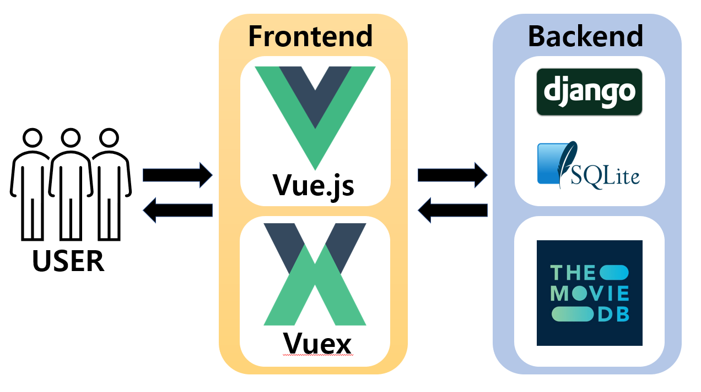
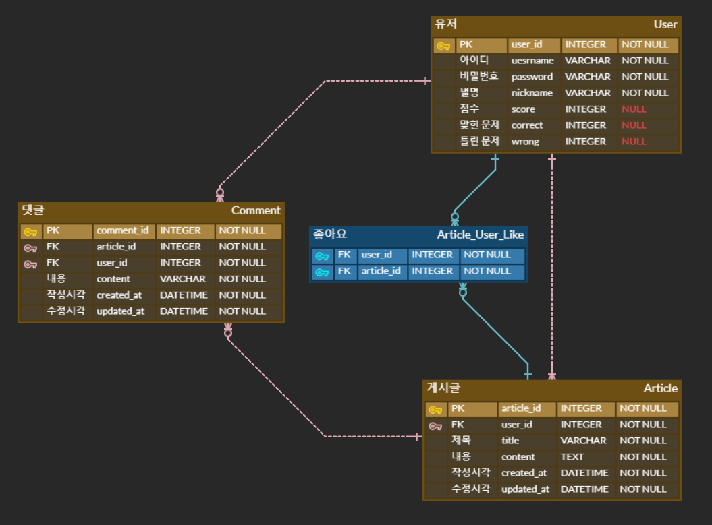
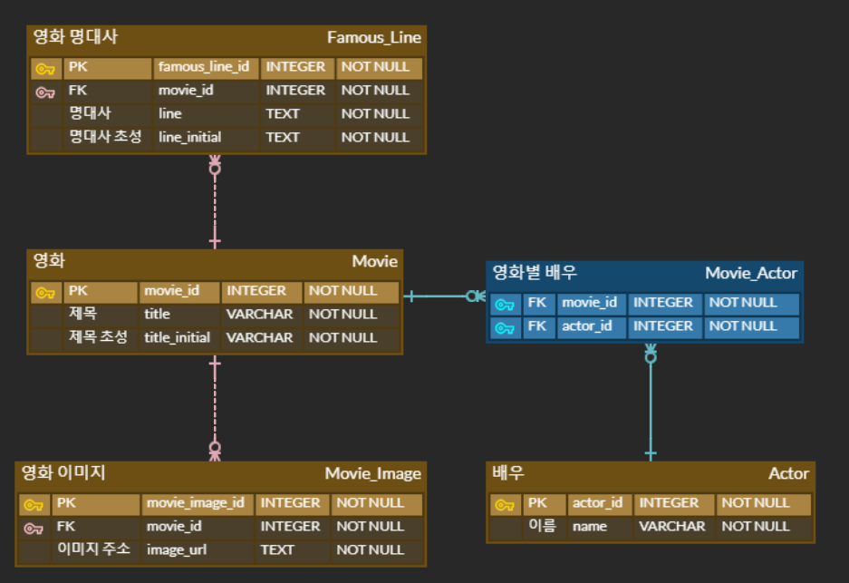
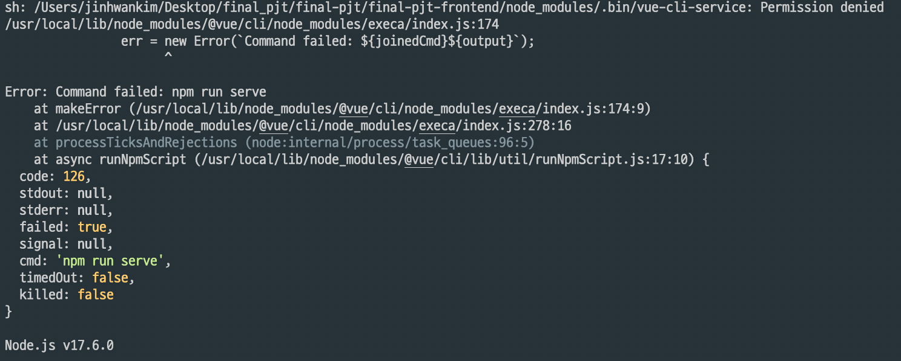

## Introduction

최근에 유행했던 Wordle에서 영감을 받아 만들게 된 영화를 이용한 퀴즈를 풀 수 있는 서비스입니다. 명대사 초성 퀴즈, 영화 장면 퀴즈, 제목 퀴즈 등 다양한 퀴즈를 풀고 획득한 점수를 기준으로 랭킹을 제공합니다. 또한 자유롭게 글을 작성할 수 있는 커뮤니티 기능과 '오늘의 영화'라는 추천 서비스도 제공합니다.

## Structure

## ERD

## API

|      App      |                URL                |         GET          |       POST        |           PUT           |      DELETE       |
| :-----------: | :-------------------------------: | :------------------: | :---------------: | :---------------------: | :---------------: |
|   accounts    |             ranking/              | get the top 10 users |         X         |            X            |         X         |
|               |              score/               |          X           |         X         | add score/correct/wrong |         X         |
|               |        profile/:username/         |     get an user      |         X         |            X            |         X         |
|               |         :user_id/follow/          |          X           |         X         | follow/unfollow an user |         X         |
|   community   |             article/              |          X           | create an article |            X            |         X         |
|               |       article/:article_id/        |    get an article    |         X         |     edit an article     | delete an article |
|               |     article/:article_id/like/     |          X           |         X         | like/unlike an article  |         X         |
|               |       :article_id/comments/       |          X           | create a comment  |            X            |         X         |
|               | :article_id/comments/:comment_id/ |          X           |         X         |            X            | delete a comment  |
| movie_quizzes |               quiz/               | get a set of quizzes |         X         |            X            |         X         |

## Trouble Shooting

django data load

vue MODULE NOT FOUND

해결법

final-pjt-frontend 내부의 node_modules 폴더 삭제 후 `npm i`
