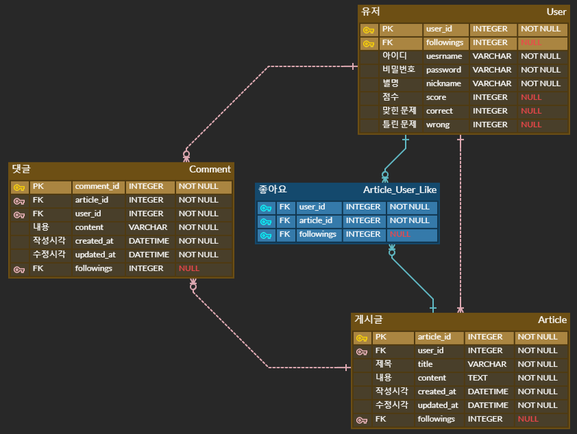

# Moquiz [22.05.23~22.05.27]


## Introduction

최근에 유행했던 Wordle에서 영감을 받아 만들게 된 영화를 이용한 퀴즈를 풀 수 있는 서비스이다. 명대사 초성 퀴즈, 영화 장면 퀴즈, 제목 퀴즈 등 다양한 퀴즈를 풀고 획득한 점수를 기준으로 랭킹을 제공한다.. 또한 자유롭게 글을 작성할 수 있는 커뮤니티 기능과 인기영화, 평점이 높은 영화, 개봉 예정 영화 등의  추천 서비스도 제공한다.


## Structure


## ERD




## API

|      App      |                URL                |         GET          |       POST        |           PUT           |      DELETE       |
| :-----------: | :-------------------------------: | :------------------: | :---------------: | :---------------------: | :---------------: |
|   accounts    |             ranking/              | get the top 10 users |         X         |            X            |         X         |
|               |              score/               |          X           |         X         | add score/correct/wrong |         X         |
|               |        profile/:username/         |     get an user      |         X         |            X            |         X         |
|               |         :user_id/follow/          |          X           |         X         | follow/unfollow an user |         X         |
|   community   |             article/              |          X           | create an article |            X            |         X         |
|               |       article/:article_id/        |    get an article    |         X         |     edit an article     | delete an article |
|               |     article/:article_id/like/     |          X           |         X         | like/unlike an article  |         X         |
|               |       :article_id/comments/       |          X           | create a comment  |            X            |         X         |
|               | :article_id/comments/:comment_id/ |          X           |         X         |            X            | delete a comment  |
| movie_quizzes |               quiz/               | get a set of quizzes |         X         |            X            |         X         |


## 고민거리

### 1. 홈페이지의 주간 박스오피스 데이터 불러오기

주간 박스오피스 데이터를 불러와 각 영화의 포스터를 나타내려고 했는데, 영화진흥위원회에서 제공하는 영화 상세정보 API에서는 포스터 정보를 제공하지 않았다. 

처음에는 박스오피스 정보를 영진위 API를 통하여 불러오고, 각 영화에 대해 Naver Search API를 이용하여 포스터 정보를 가져오려고 했다. 그런데, 짜여진 코드 상으로 홈페이지에 접속할 때 마다 API를 통하여 데이터를 불러와야하는데 그 때마다 10개가 넘어가는 박스 오피스 영화 모두에 대해 Naver Search API를 이용하여 데이터를 불러오다보니 요청이 너무 많다며 이용제한에 걸렸다. 생각해보면 각 유저가 홈페이지에 접속할 때 마다 API 통신을 반복해야하므로 매우 비효율적인 방식이었다.

두 번째는 첫 번째 방법의 연장선으로, Naver Search API를 이용하여 불러온 데이터를 DB에 저장해놓고 불러와서 사용하는 방식을 생각했고, `django crontab` 라이브러리를 이용하여 매일 자정을 기준으로 포스터 정보를 받아오는 스케줄러를 만드려고 했었다. 그런데 주간 박스오피스 영화는 계속 바뀔것이고, 따라서 포스터 정보들도 계속 바뀔텐데, DB에 저장하고 삭제하는 과정이 번거롭게 느껴졌다. 

최종적으로 API를 사용하는 것을 포기하고,  `BeautifoulSoup4` 라이브러리를 이용하여 CGV 공식 사이트에서 직접 데이터를 크롤링해오는 방식으로 선회했다. 또한 번거롭게 DB에 데이터를 넣고 삭제하는 작업을 반복하는 대신, 날짜별로 데이터를 캐싱하는 식으로 간단하게 구현했다.

```python
# community/views.py
@functools.lru_cache(None)
def fetch_data(date):
    url = 'http://www.cgv.co.kr/movies/?lt=1&ft=0'
    response = requests.get(url).text
    movies = {'boxoffice': []}
    doc = BeautifulSoup(response, 'html.parser')
    
    ...
    
    return movies
```

`@functools.lru_cache`를 이용하면 매우 간단히 `fetch_data` 함수의 결과값을 캐싱할 수 있다. 날짜별로 최초로 홈페이지에 대한 요청이 들어오면, 크롤링을 통하여 데이터를 모으고 이후 해당 데이터를 캐싱하여 응답하므로 효율적이다.


### 2. 퀴즈 정답/오답 나타내기

퀴즈를 정답/오답 여부를 어떻게 나타낼까 고민하다가 `vue-notification` 패키지를 이용하였다. 

```vue
// src/ProblemView.vue
<notifications width="45%" group="notifyApp" position="bottom center" />
```

위의 코드 한 줄만 추가하면, 유저에게 쉽게 알림을 보낼 수 있다.

```vue
// src/ProblemView.vue
<script>
...
correctAnswer() {
      this.$notify({
        group: "notifyApp",
        type: "default",
        duration: 2000,
        title: "정답!",
        text: "맞혔습니다!",
      });
    },
...
</script>
```

위의 메서드를 호출하면, 알림이 간다. 개인적으로 매우 간단하게 알림을 구현할 수 있었고, 커스텀하기도 편해서 이번 프로젝트에서 사용한 패키지 중 가장 좋게 느껴졌다.

### 정답 알림


### 오답 알림


## Trouble Shooting

### 1. 로컬 -> AWC EC2 데이터 옮기기

### 문제 상황

퀴즈 데이터들을 직접 수집하고 로컬 환경의 DB에 저장한 뒤에 AWS EC2 환경에 배포하는 과정에서 문제가 생겼다. 

`python manage.py dumpdata > data.json` 명령어를 통해서 로컬 환경의 DB를 뽑아낸 뒤, EC2에서 `python manage.py loaddata data.json`으로 데이터를 불러오려 했는데, 포맷 문제로 제대로 불러와지지 않았다. 아마도 데이터에 한글이 포함되어있어서 발생한 문제로 추측된다.

### 해결법

결국 포맷을 변환해야 했는데, NOTEPAD++로 `data.json` 파일을 불러와 UTF-8로 바꾸어 주었더니 정상적으로 데이터를 DB에 넣을 수 있었다.


### 2. vue MODULE NOT FOUND

### 문제 상황


깃을 이용하여 프로젝트를 관리했는데, 페어의 코드와 `merge`한 경우 `vue serve` 명령어가 제대로 작동하지 않았다. 이 문제는 windows에서 코드를 작성한 뒤 mac 환경에서 `pull`했을때도 발생했는데, 각 환경의 node 버전 차이때문인 것으로 추측된다.

### 해결법

node_modules 폴더를 삭제한 후 `npm i`를 이용하여 패키지를 재설치하면 정상적으로 동작했다.


## 최종 구현

### 홈페이지


### 커뮤니티


### 랭킹


### 퀴즈


### 마이페이지


